# Changelog

Toutes les modifications notables apportées à ce projet sont documentées dans ce fichier.

Le format est basé sur [Keep a Changelog](https://keepachangelog.com/fr/1.0.0/).


## [Non publié] — Pipeline d'entraînement MLP complet (2026-03-18)

### Objectif
Implémenter un pipeline complet d'entraînement et de déploiement de modèles MLP (Multilayer Perceptron) pour le contrôle du robot par apprentissage par imitation. Le modèle est entraîné côté PC avec PyTorch, converti en TensorFlow Lite, puis déployé sur le Raspberry Pi Zero 2.

### Architecture du pipeline
```
[Collecte données] → [JSONL] → [PyTorch Dataset] → [Entraînement MLP]
                                                          ↓
[Robot Pi Zero] ← [TFLite] ← [TensorFlow] ← [ONNX] ← [PyTorch Model]
```

### Ajouté

#### Module d'entraînement (`MLP_model_trainer/`)
- **`dataset.py`** — Chargement des données JSONL et création des DataLoaders PyTorch
  - Classe `ZumiControlDataset` héritant de `torch.utils.data.Dataset`
  - Fonction `create_data_loaders()` avec split train/validation (80/20)
  - Statistiques du dataset (moyennes, écarts-types, distributions)

- **`model.py`** — Architecture MLP avec plusieurs variantes
  - `ZumiMLP` : Architecture modulaire avec couches configurables
  - `ZumiMLPSmall` : Version compacte [32, 16] pour Pi Zero (1410 paramètres)
  - `ZumiMLPLarge` : Version étendue [128, 64, 32] pour tâches complexes
  - Initialisation Xavier, dropout configurable, sortie Tanh bornée [-1, 1]

- **`train.py`** — Script d'entraînement complet
  - Classe `Trainer` avec boucle d'entraînement PyTorch standard
  - Optimiseur AdamW avec weight decay (régularisation L2)
  - Learning rate scheduler `ReduceLROnPlateau`
  - Early stopping configurable (patience=20 par défaut)
  - Gradient clipping pour stabilité
  - Sauvegarde automatique du meilleur modèle + rapport JSON

- **`convert_to_tflite.py`** — Conversion vers TensorFlow Lite
  - Export PyTorch → ONNX avec `torch.onnx.export()`
  - Conversion ONNX → TensorFlow SavedModel via `onnx-tf`
  - Conversion TensorFlow → TFLite avec quantization optionnelle
  - Vérification automatique du modèle converti

- **`requirements.txt`** — Dépendances Python pour l'entraînement PC

- **`TUTORIAL_MLP_PYTORCH.md`** — Tutoriel complet de 12 sections
  - Fondamentaux PyTorch et MLPs
  - Architecture du pipeline de bout en bout
  - Explication détaillée de chaque composant
  - Techniques d'optimisation avancées
  - Guide de déploiement sur système embarqué
  - Dépannage et bonnes pratiques

#### MLController finalisé (`core/control/controlers/ml_controller.py`)
- Chargement du modèle TFLite (compatible `tflite_runtime` et `tensorflow`)
- Méthode `_build_state_vector()` pour construire le vecteur d'état depuis SensorState
- Méthode `_inference()` pour l'inférence TFLite optimisée
- Dénormalisation automatique des sorties [-1, 1] → commandes moteur
- Méthodes de debug : `get_debug_info()`, `get_params()`
- Fallback gracieux si modèle non chargé (commandes = 0)

### Données d'entraînement
- 1405 échantillons collectés via le système de sampling existant
- Format JSONL : `captures.jsonl` (états) + `labels.jsonl` (commandes)
- Vecteur d'état : 21 dimensions (6 IR + 1 flag + 4 classes + 4 bbox + 6 IMU)
- Vecteur de sortie : 2 dimensions (vitesses gauche/droite normalisées)

### Choix techniques

| Aspect | Choix | Justification |
|--------|-------|---------------|
| Framework entraînement | PyTorch | API intuitive, debugging facile, écosystème riche |
| Framework déploiement | TFLite | Optimisé ARM, faible empreinte mémoire (~5MB runtime) |
| Format intermédiaire | ONNX | Standard portable, conversion bidirectionnelle |
| Fonction d'activation sortie | Tanh | Garantit sorties dans [-1, 1] |
| Optimiseur | AdamW | Convergence rapide + weight decay correct |
| Régularisation | Dropout + L2 | Prévention du sur-apprentissage |

### Fichiers créés
- `MLP_model_trainer/dataset.py`
- `MLP_model_trainer/model.py`
- `MLP_model_trainer/train.py`
- `MLP_model_trainer/convert_to_tflite.py`
- `MLP_model_trainer/requirements.txt`
- `MLP_model_trainer/TUTORIAL_MLP_PYTORCH.md`
- `MLP_model_trainer/data/` (données extraites du sampling)

### Fichiers modifiés
- `core/control/controlers/ml_controller.py` — Implémentation complète
- `MLP_model_trainer/DEV_PLAN.md` — Mise à jour avec documentation du pipeline

### Usage
```bash
# 1. Installer les dépendances (PC)
cd MLP_model_trainer
pip install -r requirements.txt

# 2. Entraîner le modèle
python train.py --epochs 100 --model-size medium

# 3. Convertir vers TFLite
python convert_to_tflite.py --quantize

# 4. Déployer sur le robot
scp export/zumi_mlp_quant.tflite pi@<ip>:~/robot/models/
```

### Optimisation du ControlManager et de la gestion des contrôleurs
le but est d'améliorer la fluidité des commandes manuelles afin d'avoir une meilleure réactivité du robot lors du contrôle manuel, et aussi de réduire la latence globale du système pour les futurs contrôleurs ML qui seront plus gourmands en ressources. 

┌─────────────────────────────────────────────────────────────┐
│  AVANT                        APRÈS                        │
├─────────────────────────────────────────────────────────────┤
│  Polling: 250ms (4 Hz)   →   80ms (12.5 Hz)                │
│  Watchdog: 0.6s          →   0.3s                          │
│  Loop delay: fixe 50ms   →   adaptatif (33/50ms)           │
│  Line detection: toujours →   skip en manuel/ML            │
│  Debug prints: activé    →   désactivé                     │
│  Constantes: éparpillées →   centralisées                  │
└─────────────────────────────────────────────────────────────┘

---

## [Non publié] — Refactor complet du control manager (2026-03-16)

### Objectif
Refonte architecturale intégrale du module de contrôle (`core/control/`) pour adopter le patron de conception **Strategy**. Le but est de rendre l'orchestrateur (`ControlManager`) complètement agnostique (aveugle) aux détails d'implémentation des algorithmes de contrôle (PID, State Machine, ML), permettant un système 100% "Plug & Play". 



### Modifications apportées
- **Standardisation des Entrées/Sorties (DTO)** :
  - Création de `SensorState` : DTO encapsulant de manière uniforme toutes les lectures des capteurs du robot à l' instant T (IR, IMU, offset ligne, batterie, détections).
  - Création de `MotorCommand` : DTO décrivant les intentions de mouvement (`CommandType` : SPEED, TURN, STOP, FORWARD_STEP) pour abstraire l'interface matérielle.
- **Couche Drivers IO (`core/control/IO_drivers/`)** :
  - `SensorDriver` : Lit l'état du SDK robotique et de la vision pour construire et retourner un objet `SensorState` propre.
  - `MotorDriver` : Interprète les objets `MotorCommand` et les traduit en commandes hardware spécifiques de notre Zumi.
- **Contrat d'interface (Pattern Strategy)** :
  - Création de `ControllerBase` : Classe de base abstraite (ABC) dictant le format d'un contrôleur. Tout nouveau contrôleur implémente obligatoirement `step(sensor_state) -> MotorCommand`.
- **Refonte de l'orchestrateur (`ControlManager`)** :
  - Disparition complète des constantes de mode hardcodés (`MODE_PID`, etc.) et des fonctions `_tick_pid`.
  - Intégration d'un registre dynamique sous forme de dictionnaire (`_controllers`) alimenté via `register_controller(name, controller)`. 
  - La boucle principale de contrôle est désormais universelle : `1. Lecture capteurs -> 2. Inférence du contrôleur actif -> 3. Exécution de la commande moteur`.
- **Nouveaux Contrôleurs (`core/control/controlers/`)** :
  - Adaptation de la logique existante en un `LineFollowerController` unifié et compatible avec la nouvelle baseline.
  - Création à blanc d'un `MLController`, conçu comme prochain jalon utilisant un Multi-Layer Perceptron (MLP) en inférence via TFLite.
  - Création d'un `ManualController` pour le contrôle manuel via l'interface, avec PWM logiciel pour les virages (configurable).
- **Adaptateur Vision** :
  - Création de `VisionAdapter` (`core/vision/vision_adapter.py`) responsable de prendre un `SensorState` en entrée et de la vectoriser mathématiquement (Bounding Boxes, encodage one-hot des classes, normalisation MPU/IR). Ce qui retire cette lourde logique anciennement codée en dur dans les objets DTO.
- **Assainissement du module de contrôle** :
  - Déplacement des anciens outils ou algorithmes obsolètes/déclinés dans un sous-dossier de maintien `legacy/`.
- **Sampling MLP (dataset)** :
  - Export ZIP en `captures.jsonl` + `labels.jsonl` (entrees vectorisees + labels moteurs par ligne).
  - Vectorisation alignee sur `VisionAdapter` avec classes inferees depuis les detecteurs.
  - Labels derives de la derniere commande moteur (SPEED/FORWARD_STEP, STOP/TURN -> zeros).
- **Controle modulaire via ControlManager** :
  - Routes controleur mises a jour (start/stop/status) avec selection par nom de controleur.
  - Override manuel: la croix directionnelle force le basculement sur `manual_controller`.
- **UI onglet controle** :
  - Ajout d'un selecteur de controleur + bouton toggle.
  - Ajout d'un bouton de telechargement des echantillons.


## [Non publié] — Rework complet du LineDetector et intégration VisionPipeline (2026-03-05)

### Objectif
1. Uniformiser le **LineDetector** avec le format standardisé BaseDetector (`{'Object_detected', 'detections', 'logs'}`)
2. Éliminer le **circuit parallèle** où les state machines déshérissaient le détecteur directement
3. Forcer l'architecture **VisionPipeline** comme point d'accès unique pour la détection
4. Supprimer la **duplication de code** (`set_photo_directory`, accès caméra, etc.)

### Modifié

#### LineDetector (`core/vision/detectors/Line_detector.py`) — Format standardisé
- **Ancien format** : `{'detector': 'line', 'value': offset, 'Object_detected': bool, 'detections': [dicts complexes], '_annotation_data': {...}, 'detection_stats': {...}}`
- **Nouveau format** : `{'Object_detected': bool, 'detections': [], 'line_offset': offset|None, 'logs': []}`
  - Clés éliminées : `detector`, `value`, `_annotation_data`, `detection_stats`, `detection_data`
  - `line_offset` est la **clé d'extension spécialisée** pour les state machines
  - Données d'annotation internes : stockées sur `self._last_annotation_data` au lieu de retournées
  
- **Méthode `annotate_detection(frame)`** : signature modifiée
  - Ancien : `annotate_detection(frame, detection_result)` — passait le résultat entier
  - Nouveau : `annotate_detection(frame)` — lit depuis `self._last_annotation_data` intrinsèque
  - Permet une séparation nette entre **détection logique** et **annotation visuelle**
  
- **Méthode `_detect_lines()`** : nettoyage
  - Correction : `show_ROI=False` (pas d'annotation lors de la détection)
  - Suppression : code mort testant `'ctn' in dash` (clé n'existe pas, était `'contour'`)
  - Simplifie et clarifie le retour `{'offset', 'avg_cx', 'avg_cy', 'best_group', 'valid_dashes', 'image_stats'}`
  
- **Méthode `process_passive()`** : refactorisation
  - Ancien : implémentation dupliquée avec `_detect_lines()` + appels récursifs
  - Nouveau : appelle simplement `process()` + ajoute `timestamp` pour le live feed

#### State Machines (`core/control/line_following_state_machine.py`) — VisionPipeline au lieu de circuit isolé
- **Constructeur `LineFollowingStateMachine`**
  - Ancien : `__init__(robot, camera, pid_controller, line_detector, stop_condition_detector=None)`
  - Nouveau : `__init__(robot, vision_pipeline, pid_controller, stop_condition_detector=None)`
  - Caméra et détecteur de ligne **trouvés via pipeline** à la demande
  
- **Constructeur `StepByStepStateMachine`**
  - Ancien : `__init__(robot, camera, pid_controller, line_detector)`
  - Nouveau : `__init__(robot, vision_pipeline, pid_controller)`
  - Même principe : accès unifié via `vision_pipeline`
  
- **Nouveaux helpers** (tous deux machines)
  - `_find_line_detector_index()` : cherche le détecteur par `name == 'line'` dans `vision_pipeline.detectors`
  - `_run_line_detection(frame)` : exécute `vision_pipeline.process_frame(frame, index)` et extrait `line_offset`
  
- **Suppression de la duplication**
  - `set_photo_directory(dir)` éliminé → utilise `vision_pipeline.CAPTURE_DIR` directement
  - `self.camera.capture()` → `self.vision_pipeline.camera.capture()`
  - Tous les `self.line_detector.process()` → remplacés par `self._run_line_detection(frame)`
  
- **Remplacement systématique des appels**
  - Ancien : `line_result = self.line_detector.process(frame.copy())` + `line_offset = line_result.get('value')`
  - Nouveau : `line_offset = self._run_line_detection(frame)`
  - Appliqué à **10+ locations** : `_handle_waiting_approval`, `_handle_moving`, `_handle_approach_line`, `_handle_recenter`, `_handle_line_lost`, etc.

#### ControlManager (`core/control/control_manager.py`) — Extraction correcte de l'offset
- **Boucle `_control_loop()`**
  - Ancien : filtre par `res.get("detector") == "line"` + extrait `res.get("value")`
  - Nouveau : filtre par `'line_offset' in res` + extrait `res.get('line_offset')`
  - Plus robuste : fonctionne même si plusieurs détecteurs retournent `line_offset`
  
- **Méthode `_create_step_machine()`**
  - Ancien : cherchait manuellement le line_detector dans pipeline, passait camera + line_detector séparément
  - Nouveau : passe `vision_pipeline` directement, laisse le machine trouver le détecteur
  - Élimine `register_line_detector()` : plus de nécessité d'une référence globale

#### main.py — Wiring simplifié
- **Création `LineFollowingStateMachine`**
  - Ancien : `LineFollowingStateMachine(robot=zumi, camera=zumi.camera, ..., line_detector=line_detector, ...)`
    + `state_machine.set_photo_directory(PHOTOS_DIR)`
    + `control_manager.register_line_detector(line_detector)`
  - Nouveau : `LineFollowingStateMachine(robot=zumi, vision_pipeline=vision_pipeline, ...)`
    + Plus de `set_photo_directory()` ni `register_line_detector()`
    + Photos sauvegardées via `vision_pipeline.CAPTURE_DIR` configuré au bootstrap

#### VisionPipeline (`core/vision/vision_pipeline.py`) — Annotation générique
- **Méthode `annotate_detection_result(frame, detector, result)`**
  - Ancien : détectait via `result.get('detector') == 'line'` + appelait `detector.annotate_detection(frame, result)`
  - Nouveau : détecte via `'line_offset' in result` + appelle `detector.annotate_detection(frame)` (sans result)
  - Signature new-school plus simple et modulaire

#### server_controller.py (`interface/server_controller.py`) — Fallback legacy mis à jour
- **Route `pid_step_start()` — Fallback pour créer StepByStepStateMachine sans ControlManager**
  - Ancien : `StepByStepStateMachine(robot=self.robot, camera=vp.camera, pid_controller=..., line_detector=detector)`
  - Nouveau : `StepByStepStateMachine(robot=self.robot, vision_pipeline=vp, pid_controller=...)`
  - Élimine la recherche manuelle du line_detector

#### test_line_detector_refactoring.py — Mise à jour tests
- **Tous les 6 tests révisés** pour vérifier le **nouveau format standardisé**
- Tests clés :
  - ✓ Format correct : `['Object_detected', 'detections', 'line_offset', 'logs']`
  - ✓ Pas de clés anciennes : `detector`, `value`, `_annotation_data`, `detection_stats`
  - ✓ `annotate_detection(frame)` sans paramètre result
  - ✓ `process_passive()` + `timestamp`
  - ✓ Image noire → `Object_detected=False, line_offset=None`
  - ✓ Intégration VisionPipeline.annotate_detection_result()

### Impact architectural

| Aspect | Avant | Après |
|--------|-------|-------|
| **Point d'accès caméra** | Duplicé : `robot.camera`, `vision_pipeline.camera`, state machines | Unique : `vision_pipeline.camera` |
| **Détection de ligne** | Direct : `state_machine.line_detector.process()` | VisionPipeline : `_run_line_detection()` |
| **Format des résultats** | Fragmenté (3+ formats différents par détecteur) | Unifié : format BaseDetector |
| **Stockage photos** | Via attribut `self.photo_save_dir` | Via `vision_pipeline.CAPTURE_DIR` |
| **Annotation visuelle** | Embarquée dans process() | Séparée : annotate_detection(frame) |
| **Clés d'extension** | `value`, `detector`, `detection_stats` | `line_offset` simple et claire |

### Fichiers modifiés
- `core/vision/detectors/Line_detector.py` — Refactorisation majeure (format + annotation)
- `core/control/line_following_state_machine.py` — Rework complet (2 machines, helpers, wiring)
- `core/control/control_manager.py` — Extraction offset corrigée, création step_machine simplifiée
- `core/vision/vision_pipeline.py` — Annotation alignée sur nouveau format
- `main.py` — Wiring simplifié, suppression set_photo_directory + register_line_detector
- `interface/server_controller.py` — Fallback legacy mis à jour
- `test_line_detector_refactoring.py` — Tests refactorisés pour nouveau format

---

## [Non publié] — Amélioration du sctipt de préparation du zumi (2026-03-05)

### Objectif :
1. Refactor complet du script `zumi_prepare.sh` pour le rendre plus robuste, fiable et adapté aux tests terrain.
2. Ajouter une fonctionnalité de diagnostic pour vérifier que le port 5000 est bien libé avant de lancer le programme, avec un système de retry automatique.
3. Ajouter une méthode pour bootstrap le programme principale et offirir une barre de chargement pour indiquer la progression de la préparation.

### Modifications apportées
- Refactor complet de `zumi_prepare.sh` en mode plus robuste avec fonctions utilitaires (`port_is_free`, `get_pids_on_port`, `free_port`, `kill_by_pattern`).
- Réécriture de la boucle FAST pour libérer le port 5000 avec vérification réelle et retry (jusqu'à 10 tentatives) avant d'annoncer un succès.
- Correction de l'extraction des PID sur un port (méthode robuste via `ss` + fallback `fuser`) pour éviter les faux positifs de libération.
- Passage des kills critiques en `-9` pour les processus récalcitrants (`main.py`, `flask`, `werkzeug`).
- Ajout d'une vérification post-kill des processus Python restants en mode FULL.
- Suppression des credentials Wi-Fi hardcodés : le mode FULL demande maintenant SSID et mot de passe de façon interactive.
- Sécurisation du fichier temporaire Wi-Fi (`chmod 600`) et meilleure gestion de `wpa_supplicant` (arrêt propre + fallback).
- Ajout d'un retry de connectivité réseau avec plusieurs tentatives de ping avant échec.
- Nettoyage de la sortie `dhclient` pour éviter les messages parasites dans les logs.
- Le mode FULL réutilise explicitement la logique FAST en fin de parcours pour garantir que le port 5000 est libre avant lancement du programme.
- Ajout d'un handler `SIGINT`/`SIGTERM` dans `main.py` pour forcer un arrêt propre et éviter d'avoir à relancer `zumi_prepare.sh fast` entre deux tests.
- Ajout d'une barre de progression visuelle dans le terminal pour indiquer les étapes de chargement au lancement de notre programme.

### Résultat
- Le mode FAST est plus fiable et déterministe : il valide que le port 5000 est effectivement libre.
- Le mode FULL est plus versatile pour les tests terrain (choix réseau au moment du lancement).
- Réduction des cas `OSError: [Errno 98] Address already in use` lors des redémarrages rapides.


## [Non publié] — Amélioration algorithme de calcul de distance (2026-03-04)

### Objectif : 
1. Améliorer la précision du calcul de distance approximative à partir de la taille de la bounding box.

### Solution proposée :
- La première estimation de la distance focale c'est basé sur 2 point (15 et 30 cm). pour améliorer la précision on va ajouter 2 points supplémentaires (20 et 45 cm) pour faire une régression linéaire plus précise.

### Modification apporté
- réduction de la férquence de polling de l'utilisation des ressources à 20 sec au lieu de 5.
- Comme il semble y avoir une légère distortion entre les objets, on change l'apporche de la focale globale pour une focale spécifique par objet.
- On a précédement déterminer les distance focale en utilisant des moyennes, mais pour améliorer la précision on va faire une régression linéaire pour chaque objet en utilisant les 4 points de données (15, 20, 30, 45 cm) au lieu de 2 points (15 et 30 cm). pour faire la régression j'ai fait un script `Régression_lin_distance_focale.py` qui utilise la méthode des moindres carrés pour trouver les coefficients de la régression linéaire (focale = a * taille_image + b).
- j'ai entrainer un nouveau modèle pour les panneau stop et il torche le cul du modèle de git big time. genre il peut voir dans le noir et les résultats de son approximation sont beaucoup plus précis que le modèle de git. dire que je viens d'entrainer mon meilleur modèle avec moins de 200 images positives. je pense que le maxFalseAlarmRate de 0.4 a vraiment aidé à améliorer la précision du modèle, ça a permis d'avoir des bounding box plus précises ce qui a un impact direct sur la précision du calcul de distance. je vais tenter de log les résultats pour ajouter au rapport plus tard.
- ajout d'une limite de fréquence d'annotation sur le live feed pour réduire la charge CPU (annotation toutes les 10 frames (0.5s à 20fps))
- j'ai aussi changer la fréquence de détection passive de 4sec a 0.5sec pour le moment tout semble bien aller et sa semble être bénéfique en basse résolution. avec l'arrivé des nouveau Pi V2 on va pouvoir se gater un peu plus niveau ressources.
### Commentaires :
- la première implémentation a été fait avec 2 points (15 et 30 cm), les résultats était relativement bien avec une erreur d'environ 3-4 cm à 30 cm et plus, ces pour quoi on a décider d'ajouter 2 point supplémentaire pour améliorer la précision. cela dit ce n'est pas la seul chose qui sera tester, on va également essayer une focale spécifique par objet et on va tenter 2 méthodes pour les calculer (moyenne et régression linéaire) pour voir laquelle donne les meilleurs résultats. je vais tenter de log les résultats pour ajouter au rapport plus tard.
- après expérimentation, il n'y a pas de différence significative entre les deux méthodes. ce qui a un plus gros impact cependant ces la qualité des bounding box du modèle. si elle sont trop large ou trop mince cela va fausser le calcul de la distance. c'est pour ça que je pense que l'amélioration de la précision du modèle de détection aura un impact plus significatif sur la précision du calcul de distance que l'amélioration de la méthode de calcul elle même.

#### Résumé pour le rapport
La conclusion que tu devrais tirer de cette analyse est la suivante : le modèle pinhole avec focale fixe est adéquat pour des distances courtes (15–30 cm), mais sa précision est fondamentalement limitée par la qualité des bounding boxes produites par le détecteur HAAR, et non par la méthode d'estimation de la constante focale. L'amélioration prioritaire serait donc d'améliorer la précision des bounding boxes via un meilleur entraînement du modèle, ou d'introduire un facteur correctif empirique par classe d'objet.

---

## [Non publié] — Resources Monitoring (2026-02-27)

### Objectif : 
1. Implémenter un système de monitoring des ressources (CPU, RAM) pour la détection passive en temps réel, avec affichage dans le terminal.
2. voir si ya moyen de faire du calcul de distance approximative à partir de la taille de la bounding box (pour future estimation de distance à l'objet)
### Contraintes :
- Doit être très léger, on refresh les stats toutes les 5 secondes seulement
- Affichage clair et lisible dans le terminal (pas de logs redondants)
- Utilisation de `psutil` pour les stats système (CPU, RAM)
- Calcul de distance approximative basé sur la taille de la bounding box (en pixels) et une estimation de la taille réelle de l'objet. On va se baser sur la formule de la distance focale : `distance = (taille_reelle * focale) / taille_image`
- La focale peut être estimée à partir de tests préliminaires (ex: mesurer la taille de la bounding box pour un objet à une distance connue)


## [Non publié] — Révision majeure de la détection passive et hard positive mining (2026-02-26)

### Ajouté

#### Détection en temps réel — Compteur visuel live
- **Compteur de détections** sur le live feed : badge vert en haut à gauche montrant le nombre de détections courantes
  - Implémenté dans `_draw_passive_overlay()` via `cv2.putText()` — zero overhead (~0.01ms/frame)
  - Fournit un feedback visuel instantané sans requête HTTP supplémentaire

#### Système de résolution caméra dynamique
- **Dropdown de résolution** remplaçant l'ancien toggle "High Res" (`interface/onglet_vision.py`)
  - 4 options natives : QQVGA 160×128 (défaut), QCIF 176×144, QVGA 320×240, VGA 640×480
  - Changement appliqué immédiatement : ferme caméra → change résolution → relance flux et détection passive
  - La résolution sélectionnée affecte **tous les aspects** : live feed, captures, détection passive (une seule instance caméra)
- **Endpoint backend** : `POST /set_resolution` avec JSON `{width, height}`
- **Méthode pipeline** : `VisionPipeline.change_camera_resolution(w, h)` instancie une caméra à la nouvelle résolution
- Passe de `capture_hires()` temporaire à une approche unifiée (plus simple, plus robuste)

#### Hard Positive Mining — Système complet de collecte d'entraînement
- **Architecture** : Quand le mining est activé, chaque détection passive réussie génère un crop de la bounding box
  - Stockage temporaire dans `captured_images/mining_crops/` pendant la session
  - Nommage descriptif : `<objet>_<timestamp>_<largeur>x<hauteur>_<uuid>.jpg`
    - Exemple : `Stop_Sign_20260226_143022_45x52_a3f2b1.jpg`
    - Facilite le tri rapide des images et l'identification manuelle lors du téléchargement
  
- **Méthodes VisionPipeline** (`core/vision/vision_pipeline.py`)
  - `_harvest_crops(frame, detections)` — Extraction et sauvegarde des crops (appelée depuis thread passive)
  - `enable_mining()` / `disable_mining()` — Contrôle du mode mining
  - `get_mining_stats()` — Statistiques courantes (total, par objet)
  - `collect_mining_crops()` — Liste tous les fichiers crop
  - `clear_mining_crops()` — Supprime tous les crops + remet compteurs à zéro

- **Endpoints serveur** (`interface/server_controller.py`, `interface/flask_router.py`)
  - `POST /toggle_mining` — Active/désactive le mining + retourne stats
  - `GET /mining_stats` — Poll des statistiques (refresh JS toutes les 3s)
  - `GET /download_mining_crops` — ZIP en mémoire + envoi client + suppression robot (évite memory leak)

- **UI interactif** (`interface/onglet_vision.py`)
  - Bouton toggle `⛏️ Mining Off/On` (classe `remoteDL-toggle-btn`)
  - Badge violet affichant total + détails par objet (ex: "12 crops (Stop_Sign: 8, Pieton: 4)")
  - Bouton download `📖 Download Crops` (activé uniquement quand ≥1 crop disponible)
  - Polling automatique des stats toutes les 3 secondes pendant le mining
  - Feedback toast lors de l'activation/désactivation et téléchargement

- **Performance** : Extraction + I/O (cv2.imwrite) se fait pendant le `sleep(1.0s)` du thread passive (~0.5ms/crop), n'impacte pas le live feed

### Modifié

#### Déploiement et correction des bugs post-test
- **StopDetectorMatt** — Standardization complète du format de sortie
  - `process_passive()` implémentation légère (évite disk I/O, `url_for`, création dossier diagnostic)
  - `process()` retourne maintenant `{Object_detected, detections: [...], logs}` (format standardisé)
  - Ajout imports : `import time` et try/except pour `url_for` (compatibility Flask optionnel)

- **Détecteur d'indicateur** — Fix CSS color bug
  - `runDetection()` et `runDiagnostics()` maintenant `classList.remove('on', 'off')` avant d'ajouter la nouvelle classe
  - Prévient accumulation de classes et CSS specificity issues (rouge restait coincé)

- **Passive Detection button** — Implémentation fonctionnelle
  - `togglePassiveDetection()` appelle maintenant `POST /start_passive_detection` ou `/stop_passive_detection`
  - Pas juste un toggle visuel — action backend réelle

- **Typo parameter** — `vision_pipeline.start_passive_detection(detctor_index=...)` → `detector_index=...`

- **Layout caméra** — Flex grid plus clean
  - Boutons groupés dans containers flex avec `gap: 8px` et `flex-wrap: wrap`
  - Removed hardcoded `margin-top: 15px` des toggle buttons CSS (maintenant géré par gap)

### Technique - Performance & Architecture

- **Zero-overhead live stats** : Compteur dessiné directement sur frame (cv2.putText) au lieu de polling JS
- **Thread-safe mining** : Mutex `_mining_lock` pour les compteurs partagés entre threads passive + HTTP
- **Memory-safe cleanup** : ZIP temporaire en mémoire, suppression crops après envoi client
- **Modularité caméra** : `change_camera_resolution()` réutilise le même type de caméra (ZumiCamera, ou autre)
- **Pas de breaking change** : Former API reste fonctionnelle (backward compatible)

---

## [Non publié] — Branche Haar_Classifier (2026-02-09)

### Ajouté
- **HaarClassifier** — Détecteur générique Haar Cascade multi-modèles (`core/vision/detectors/Haar_classifier.py`)
  - Chargement dynamique : `add_classifier(name, xml_path)` / `remove_classifier(name)`
  - Détection multi-classifieurs avec fusion des résultats
  - Paramètres configurables par classifieur : `scaleFactor`, `minNeighbors`, `minSize`
  - Méthode `diagnostique_detecteur()` avec balayage automatique de paramètres
- Dossier centralisé pour les modèles `.xml` : `core/vision/detectors/models/`
- Chargement des modèles via chemin absolu résolu depuis `main.py`

### Modifié
- **StopDetectorZumi** (`core/vision/detectors/Stop_detector_zumi.py`)
  - Classe renommée `StopDetector` → `StopDetectorZumi`
  - Format de sortie unifié : `{Object_detected, detection_box, confidence, area, logs, source_file_url, annotated_url}`
  - Ajout de `diagnostique_detecteur(filename)` avec balayage de paramètres
- **Consolidation JS** (`interface/onglet_vision.py`)
  - Trois fonctions de diagnostic fusionnées en `runDiagnostics()` générique
  - `updateStopUIPanelVisibility()` → `updateDiagnosticPanelVisibility()` (tous détecteurs)
- **Corrections UI Accueil** (`interface/onglet_acceuil.py`)
  - 12 erreurs CSS `}}` corrigées
  - Bug `getElementById('camBtn')` → `getElementById('cameraToggleBtn')`
  - Remplacement `ontouchstart` inline par `addEventListener(..., {passive: true})`

### Supprimé
- Route legacy `/diagnose_stop` (`flask_router.py`, `server_controller.py`)
- Import `itertools` (plus utilisé)

---

## [Non publié] — Branche Detecteur_Stop_Zumi (2026-02-06)

### Ajouté
- **StopDetectorCV** — Détecteur HSV conventionnel (`core/vision/detectors/Stop_detector_cv.py`)
  - Segmentation HSV double plage (rouge H=[0-10] + [160-180])
  - Prétraitement morphologique (MORPH_OPEN + MORPH_CLOSE)
  - Filtrage multi-critères : aire, ratio, polygone, solidité convexe, remplissage
- **StopDetectorMatt** — Détecteur HSV avancé (`core/vision/detectors/Stop_detector_matt.py`)
  - Score composite pondéré (ratio rouge/blanc, centrage texte, bordures, aspect, pureté, taille)
  - Seuil adaptatif `min_score` configurable (défaut 0.35)
  - Soft gate pureté (remplace le hard gate qui causait des faux négatifs)
- **Système de diagnostic générique** (`core/vision/vision_pipeline.py`)
  - Méthode `get_current_detector_diagnostic()` déléguant au détecteur actif
  - Overlays automatiques (contours, candidats rejetés, meilleure détection)
  - Sauvegarde dans `static/captured_images/diagnostics/`
- **Routes backend** : `POST /diagnose_detector`, `POST /run_detection`
- **Panel diagnostic interactif** dans l'onglet Vision (indicateur dynamique, terminal de logs)
- **Galerie d'images diagnostic** (ouverture dans un nouvel onglet)
- **Format de logs unifié** via `format_detection_result()`

### Modifié
- Format de résultat standardisé sur tous les détecteurs
- Support format BGR maintenu partout (convention OpenCV)

---

## [Non publié] — Architecture initiale (2026-01)

### Ajouté
- **Refonte complète de l'architecture** — Modularisation du code monolithique de l'équipe précédente
  - Module `core/camera/` : drivers caméra isolés avec interface abstraite `camera_base`
  - Module `core/vision/` : pipeline de vision + détecteurs indépendants
  - Module `core/robot/` : logique robot avec abstraction `robot_base`
  - Module `interface/` : serveur Flask modulaire avec onglets
- **Serveur Flask** (`interface/`)
  - Framework web dédié à la vision avec live feed caméra
  - Capture d'image, sélection de détecteur, exécution de détection
  - Onglets modulaires (accueil, vision, template)
  - Routes : `GET /detectors`, `POST /detector`, `POST /run_detection`
- **StopDetectorZumi** — Ground truth basé sur l'API `find_stop_sign()` de la librairie Zumi
- **Compatibilité Zumi** — Adaptation Python 3.5.3 (pas de f-strings, encodage UTF-8)
- **Script `zumi_prepare.sh`** — Préparation du robot (arrêt des processus de base, libération des ressources)
- **Contrôle moteur** via le serveur Flask
- **Toggle download automatique** des images capturées
- **Bouton exit** sur la page d'accueil

### Modifié
- Migration de `Camera` vers `ZumiCamera` dans `robot_zumi.py`
